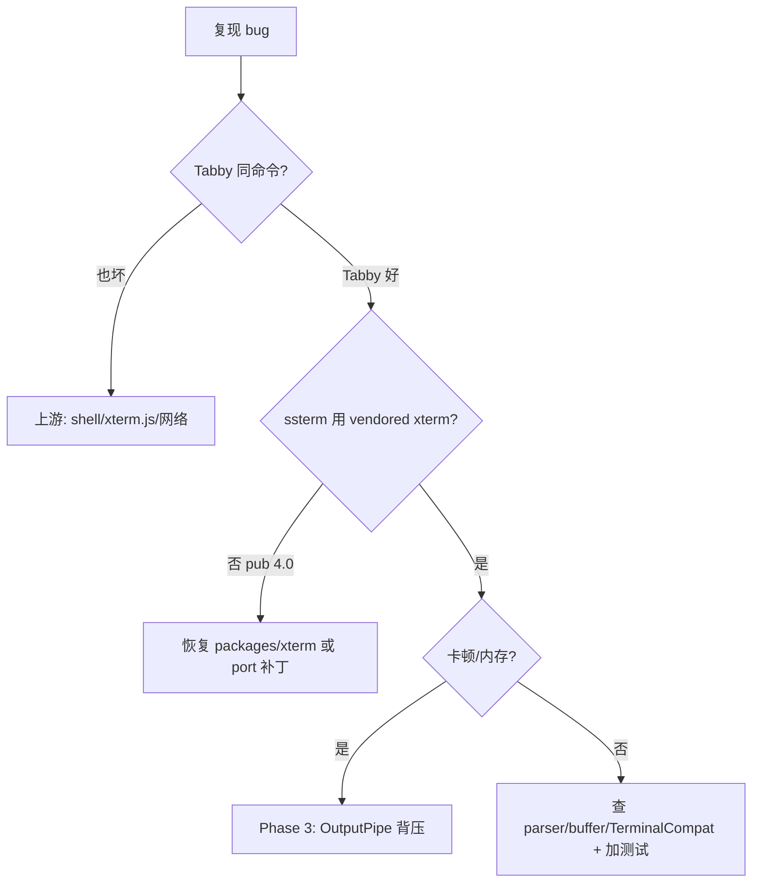
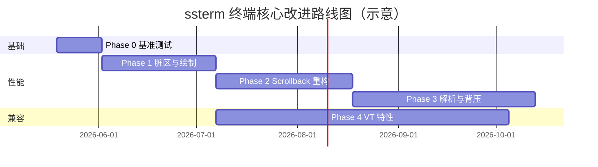

# ssterm / iTerm2 / Tabby 终端对比及改进计划

> 对比基准：  
> - **ssterm** — `/Users/illya/Projects/ssterm`  
> - **iTerm2** — `/Users/illya/Projects/iterm2`  
> - **Tabby** — `/Users/illya/Projects/tabby`（原 Terminus）  
>
> 文档日期：2026-05-18  
> 范围：终端仿真核心与 I/O 管线；不含各产品的插件市场、Instant Replay、安全扫描等业务功能。

---

## 1. 执行摘要

| 维度 | ssterm | iTerm2 | Tabby |
|------|--------|--------|-------|
| 技术栈 | Flutter + xterm.dart + flutter_pty + dartssh2 | ObjC/Swift + 自研 VT100 + Metal | Electron + Angular + **xterm.js** + node-pty + russh |
| 终端引擎 | 自研 Dart 解析/缓冲 | 自研 C/ObjC 解析/缓冲 | **xterm.js 5.x**（不自己写 VT） |
| 并发 | 单 UI isolate 同步处理 | 解析线程 → 变更队列 → 主线程绘制 | 主进程 PTY + 渲染进程；RxJS 串行写 xterm |
| 背压 | microtask 合并，**无** PTY/xterm 反压 | TokenExecutor 阻塞读 | **PTY pause + xterm FlowControl + ack** |
| Scrollback | 环形 `BufferLine`，app 常设 5000 行 | LineBlock 分块 + 宽度缓存 | xterm 内置，默认 **25000** 行 |
| 渲染 | Flutter Paragraph LRU | Metal 行级 dirty | WebGL / Canvas addon |
| 工程规模 | 小（可 vendoring 仿真层） | 极大 | 大（插件 monorepo） |

**结论（算法层）**：iTerm2 强在**自研仿真深度**（脏区、scrollback 语义、线程模型）；Tabby 强在**工程化 I/O 与 xterm.js 生态**（背压、会话中间件、滚动钉住），几乎不碰 VT 解析。ssterm 夹在中间：仿真要自己维护（像 iTerm2），但架构更像「单线程 Tabby 精简版」，**缺 Tabby 的背压/会话层，也缺 iTerm2 的增量绘制与 scrollback**。

**结论（修 bug 实践）**：显示/兼容类 bug → 优先对齐 **xterm.js 行为** 或保留 **vendored TerminalCompat**；卡顿/爆内存 → 优先抄 **Tabby 的 FlowControl + PTY ack**；历史/选择/resize 错乱 → 参考 **iTerm2 LineBuffer**。

---

## 2. 整体架构对比

### 2.1 ssterm 数据流

```
PTY / SSH 字节流
  → _OutputPipe（microtask 合并）
  → UTF-8 decode
  → Terminal.write
  → EscapeParser（查表 + ByteConsumer）
  → Buffer（主/备用屏）
  → notifyListeners
  → RenderTerminal.paint（视口行裁剪 + ParagraphCache）
```

关键文件：

| 层级 | 路径 |
|------|------|
| 应用 I/O | `lib/main.dart`（`_OutputPipe`） |
| 仿真入口 | `packages/xterm/lib/src/terminal.dart` 或 pub `xterm` |
| 转义解析 | `packages/xterm/lib/src/core/escape/parser.dart` |
| 屏缓冲 | `packages/xterm/lib/src/core/buffer/buffer.dart`、`line.dart` |
| 绘制 | `packages/xterm/lib/src/ui/render.dart`、`painter.dart` |
| 本地 PTY | `packages/flutter_pty/` 或 pub `flutter_pty` |

### 2.2 iTerm2 数据流

```
TaskNotifier 线程 select(PTY FD)
  → VT100Parser（分族解析器 + ASCII 快路径）
  → VT100Token[]（CVector 对象池）
  → TokenExecutor（GCD 变更队列，可背压阻塞读）
  → VT100ScreenMutableState（VT100Grid + LineBuffer）
  → 主线程 synchronize → VT100ScreenState
  → PTYTextView refresh → Metal / AppKit 逐行 invalidation
```

关键目录：`sources/VT100/`、`sources/VT100Screen/`、`sources/LineBuffer/`、`sources/MetalRenderer/`、`sources/Tasks/`。

### 2.3 架构差异（算法层面）

| 模式 | ssterm | iTerm2 | 影响 |
|------|--------|--------|------|
| 解析 vs 改屏 | 同步、同 isolate | 解析线程 + 串行 mutation 队列 | 大量输出时 iTerm2 UI 更少卡顿 |
| 屏状态快照 | 读写同一 `Terminal` | mutable / immutable 双态同步 | iTerm2 绘制不阻塞 PTY 写入 |
| 背压 | 无（Dart 流 + microtask） | `TokenExecutor` 信号量阻塞读 | iTerm2 避免内存无限堆积 |
| 平台绑定 | Flutter 抽象 | macOS Metal + AppKit | Chromium + WebGL；跨平台一致 |

### 2.4 Tabby 数据流

```
node-pty（Electron 主进程）
  → PTYDataQueue（UTF8Splitter、chunk≤100KB、超 500KB pause）
  → IPC pty:data → 渲染进程 tabby-local Session
  → ackData(consumedBytes) → 主进程 resume
  → BaseSession.middleware（OSC / 登录脚本 / 流处理）
  → output$ → BaseTerminalTab.write()（frontendWriteLock 串行）
  → XTermFrontend.FlowControl → xterm.write（高/低 watermark）
  → xterm.js 内部 buffer + WebGL/Canvas 绘制
```

SSH：`russh` shell channel → 同一 `BaseSession.emitOutput` → 同上。

关键路径：

| 层级 | 路径 |
|------|------|
| 主进程 PTY | `/Users/illya/Projects/tabby/app/lib/pty.ts` |
| 会话抽象 | `/Users/illya/Projects/tabby/tabby-terminal/src/session.ts` |
| Tab 桥接 | `/Users/illya/Projects/tabby/tabby-terminal/src/api/baseTerminalTab.component.ts` |
| xterm 前端 | `/Users/illya/Projects/tabby/tabby-terminal/src/frontends/xtermFrontend.ts` |
| 本地 shell | `/Users/illya/Projects/tabby/tabby-local/src/session.ts` |
| SSH shell | `/Users/illya/Projects/tabby/tabby-ssh/src/session/shell.ts` |

---

## 3. 分模块算法对比

### 3.1 VT100/ANSI 转义解析

#### ssterm（xterm.dart）

- **机制**：`FastLookupTable` 对 C0/C1、`ESC` 后继、CSI 首字节 O(1) 分派；CSI/OSC 用 `ByteConsumer` 增量消费，不完整序列可 rollback。
- **设计目标**：解析过程尽量少分配；无跨 chunk 的持久 FSM 状态（每 `write` 块内自洽）。
- **文本**：按 UTF-8 rune 写入 buffer；宽字符用 `unicode_v11.wcwidth`。
- **缺口**（代码中 TODO/未实现）：Sixel（`ESC P`）、G2/G3 charset、完整 application keypad 等。

#### iTerm2

- **机制**：「分族解析器」而非单一巨型 FSM——`VT100ControlParser` 路由到 `VT100CSIParser`、`VT100DCSParser`、`VT100XtermParser`、`VT100StringParser`。
- **优化**：
  - **ASCII 快路径**：连续可打印 ASCII 直接 `VT100_ASCIISTRING`，跳过通用转义状态机。
  - **CSI 参数打包**：`CSIParam` 固定数组存 params/subparams，避免动态集合。
  - **Token 化**：字节流先变为 `VT100Token`，再批量执行；相邻 token 可 **gang 合并**（`VT100_GANG`）降低 delegate 开销。
  - **异步非 ASCII 预转换**：`iTermAsyncStringConversion` 在解析线程用影子 SGR 状态预处理。

#### 差异小结

| 项 | ssterm | iTerm2 |
|----|--------|--------|
| 解析输出 | 直接调用 `EscapeHandler` 方法 | Token 队列 → Terminal.execute |
| 快路径 | 查表跳 C0，无专用 ASCII run | 显式 mixed-ASCII run |
| DCS 生态 | 有限 | tmux、SSH conductor、sixel、kitty 等 hook |
| 分配策略 | 目标零分配；`ByteConsumer.add` 仍建 rune 列表 | Token 对象池 + CVector |

---

### 3.2 屏缓冲与单元格模型

#### ssterm

- **单元格**：每格 4×`uint32`（前景、背景、属性、内容+宽度），见 `cell.dart`、`line.dart`。
- **结构**：主屏 + 备用屏各一个 `Buffer`；行容器为 `IndexAwareCircularBuffer<BufferLine>`，上限 `maxLines`（应用层本地终端常为 **5000**）。
- **滚动**：
  - 主屏：`lineFeed` 顶行 `push` 进环形缓冲；超 cap 丢弃最旧行。
  - 备用屏：不增长 scrollback。
- **宽字符**：占两列，次列为占位零宽格。
- **重排**：`reflow.dart` 在 `Buffer.resize` 且 `reflowEnabled` 时按新宽度折行/拆行（主屏）。

#### iTerm2

- **单元格**：`screen_char_t`——UTF-16 或字符串表索引、256/真彩、**延续列**（`EOL_HARD`/`EOL_SOFT`/`DWC_SKIP` 等）。
- **活动屏**：`VT100Grid` 固定 `width×height`，`screenTop_` 环形索引，滚动时尽量旋转索引而非整表 memmove。
- **备用屏**：独立 grid；`iTermTemporaryDoubleBufferedGridController` 在同步更新时避免半帧闪烁。
- **脏标记**：每行 `VT100LineInfo` 维护 `NSIndexSet` 级 dirty range（仅活动 grid，scrollback 不按格脏）。

#### 差异小结

| 项 | ssterm | iTerm2 |
|----|--------|--------|
| 行语义 | 固定列数组 | 未折行物理行 + 按宽度 wrap 的「逻辑行」 |
| 延续列/软换行 | reflow 时处理 | 显式 EOL 标志与 DWC_SKIP |
| 脏区 | 无行级脏标记；整终端 `notifyListeners` | 行级 dirty set |
| 字符串存储 | 码点 inline 在 cell | 复杂字符可走 string table |

---

### 3.3 Scrollback（历史缓冲）

#### ssterm

- 与主 buffer **同一** `IndexAwareCircularBuffer`：scrollback 即「超出视口高度的已滚出行」。
- 折行：**resize 时** reflow；scrollback 内行宽随当前终端宽度变化（历史行会被重排）。
- 内存：`列数 × 行数 × 16 字节/格` 量级，5000 行 × 200 列 ≈ 16MB 量级（未计对象头）。

#### iTerm2

- **两层**：活动 `VT100Grid` + 独立 `LineBuffer`。
- **LineBlock**：大块原始未折行数据，**写时复制（COW）**；按终端宽度 **缓存** 折行后的行数（`numLinesWithWidth:`）。
- **溢出语义**：`scrollbackOverflow`、`droppedChars` 供 UI/选择器修正索引。
- **部分行**：`appendLine:partial:` 支持流式输出未换行结尾。

#### 差异小结

| 项 | ssterm | iTerm2 |
|----|--------|--------|
| 存储模型 | 环形定长行数组 | 分块 + 宽度相关 wrap 缓存 |
| 宽度变化 | reflow 改写历史 | 查询时按 width 计算逻辑行 |
| 选择与搜索 | 基于当前 buffer 索引 | 需处理 overflow 与 DWC |
| 内存弹性 | 硬 cap 丢最旧 | 块级丢弃 + 统计 |

---

### 3.4 渲染管线

#### ssterm

- `RenderTerminal`（`RenderBox`）在 `paint()` 中：
  1. 由 `ViewportOffset` 计算可见行范围（**视口裁剪**）。
  2. `TerminalPainter` 逐格绘制；`ParagraphCache`（LRU 10240）缓存相同样式+码点的 `Paragraph.layout`。
  3. 任意 `Terminal` 变更 → `markNeedsPaint()`（**整组件重绘**，但只画可见行）。
- 无 GPU 纹理图集；依赖 Flutter 文本布局。
- 应用层 `terminal_surface.dart` 可加壁纸等效果。

#### iTerm2

- `PTYTextView -refresh` → `synchronizeWithConfig` 合并 mutable → immutable state。
- `updateDirtyRects`：**按行** `setNeedsDisplayOnLine`；滚动或 `allDirty` 时整 view 重绘。
- **Metal**：`iTermMetalDriver` + 多 pass（背景、光标、标记、kitty 图等）+ ASCII atlas。
- **DVR（Instant Replay）**：仅编码「干净行」集合，依赖 dirty 跟踪。

#### 差异小结

| 项 | ssterm | iTerm2 |
|----|--------|--------|
| 失效粒度 | Terminal 级 listener | 行级 dirty rect |
| 滚动时绘制 | 重新计算可见行（已裁剪） | `haveScrolled` 常触发全 view |
| 字形缓存 | Paragraph LRU | Metal glyph atlas |
| 跨平台 | Flutter 一致 | macOS 为主 |

---

### 3.5 PTY / 会话 I/O

#### ssterm

- **flutter_pty**：`forkpty` 子进程；pthread **1KB** 读循环 → `Dart_PostCObject`。
- **应用**：`_OutputPipe` microtask 合并；`onResize` 后再 `Pty.start`（避免 80×24 初值）。
- **SSH**：`dartssh2` + `NoDelaySocket`；keepalive / 自动重连在应用层。
- **无** 全局 `select` 多路复用、无读侧背压、无 multi-server PTY 守护进程。

#### iTerm2

- **TaskNotifier**：单线程 `select()` 所有 session FD。
- **PTYTask** → `threadedReadTask` 进解析管线；**TokenExecutor** 队列深时阻塞读。
- **Job 管理**：legacy / mono-server / multi-server（FD 传递、会话恢复）。
- **副作用通道**：coprocess、SSH conductor DCS 等与仿真并列。

---

### 3.6 应用层差异（非仿真，但影响体验）

| 能力 | ssterm | iTerm2 | Tabby |
|------|--------|--------|-------|
| SSH/SFTP/端口转发/Jump | ✅ dartssh2 | 外部/插件 | ✅ russh + 配置配置项 |
| 插件扩展 | 无 | 脚本/Python API | ✅ webpack 插件 monorepo |
| 分屏 | ✅ | ✅ | ✅ |
| 会话恢复 | 无（仅日志字节） | DVR | SerializeAddon ~1000 行 |
| 鼠标/图像 | xterm.dart 子集 | kitty/sixel 等 | xterm addon（Image/WebGL） |

### 3.7 Tabby：I/O 与渲染（实践重点）

Tabby **不实现 VT 状态机**，把仿真交给 xterm.js；价值在「字节流到屏幕」之间的胶水层。

| 机制 | 做法 | ssterm 现状 |
|------|------|-------------|
| **PTY 背压** | `PTYDataQueue`：`delta > 500KB` → `pty.pause()`；渲染 `ack` 后 `resume` | `_OutputPipe` 仅 microtask 合并，**不 pause 读** |
| **xterm 背压** | `FlowControl`：pending write 回调 >10 阻塞上游；累计 128KB 走回调路径 | 无；`terminal.write` 一口气吃完 |
| **写串行化** | `frontendWriteLock` 链式 Promise | 单 isolate 顺序调用，但无「UI 未就绪」队列 |
| **启动缓冲** | `initialDataBuffer` 直到 `releaseInitialDataBuffer()` | SSH/PTY 输出可能在 `TerminalView` layout 前写入 |
| **UTF-8** | 主进程 `UTF8Splitter`，避免 IPC 边界断码 | `_flush` 整段 `utf8.decode(allowMalformed: true)` |
| **滚动钉住** | patch `scrollToBottom` + `pinnedToBottom` + 滚轮逻辑 | 依赖 xterm.dart 默认滚动 |
| **非激活 Tab** | canvas 尺寸置 0 省 GPU；激活时 force resize | `syncAfterShown` 扩展（布局刷新） |
| **resize** | `FitAddon` + debounce 100ms → `session.resize` | `onResize` + deferred PTY start ✅ |

---

## 4. 差距矩阵（优先级标注）

| ID | 差距 | 严重度 | 建议借鉴 |
|----|------|--------|----------|
| G1 | 大量输出时 UI isolate 解析+绘制阻塞 | 高 | iTerm2 时间片/Isolate；**Tabby FlowControl** |
| G2 | 无行级 dirty，Paragraph 过量 layout | 高 | iTerm2 行 dirty |
| G3 | Scrollback 内存与 resize 语义 | 中 | iTerm2 LineBlock；Tabby 用大 scrollback 但交给 xterm.js |
| G4 | VT 特性不全（Sixel、DCS…） | 中-低 | **Tabby/xterm.js** 已覆盖；ssterm 需在 xterm.dart 补 |
| G5 | **无 PTY 读背压** | 高 | **Tabby PTYDataQueue + ack**（比 iTerm2 更易移植） |
| G6 | UTF-8 整段 decode | 中 | **Tabby UTF8Splitter** 思路 |
| G7 | 无 immutable 屏快照 | 低 | iTerm2 |
| G8 | vim/alt-buffer 显示 bug | 高 | **vendored TerminalCompat**；对照 xterm.js 行为 |
| G9 | 连接/重连瞬间花屏、丢行 | 中 | **Tabby initialDataBuffer** |
| G10 | 快速输出时滚动条乱跳 | 中 | **Tabby pinnedToBottom** |
| G11 | 并发 `write`/重入 | 低-中 | **Tabby frontendWriteLock** |

---

## 5. 改进计划（分阶段）

原则：**先正确性与流畅度，再特性广度**；保持 Flutter 跨平台，不引入 iTerm2 级全量复杂度。

### Phase 0 — 基线与度量（1–2 周）

- [ ] 建立基准：`cat huge.txt`、`yes`、`vim` 滚动、全屏 `htop`、`resize` 折行。
- [ ] 指标：帧时间、parse+write 耗时、`ParagraphCache` 命中率、scrollback 内存、SSH 吞吐。
- [ ] 文档化当前 `maxLines`、reflow 开关的推荐配置。

**产出**：`benchmark/` 脚本或集成测试 + CI 阈值（可选）。

---

### Phase 1 — 渲染与失效优化（高 ROI，3–5 周）

对标 iTerm2 的 **行级 dirty**，在 xterm 包内实现：

1. **行脏标记**  
   - `BufferLine` 或 `Buffer` 维护 `dirty` 行集合；`write`/`scroll`/`erase` 只标记受影响行。  
   - `RenderTerminal`：`markNeedsPaint` 改为可选「脏行包围盒」合并（Flutter `markNeedsPaint` 仍可用，但 `paint()` 跳过干净行）。

2. **滚动优化**  
   - 区分「内容变更」与「纯视口滚动」：后者仅改 `ViewportOffset`，不触发全 buffer 重算。  
   - 备用屏 alt-scroll 已有 `scroll_handler` 合并，保持与 vim 兼容测试。

3. **ParagraphCache 键优化**  
   - 审视 hash 碰撞与属性组合；对 ASCII 快路径用 `TextPainter` 直接 draw，绕过 Paragraph。

4. **可选：Impeller/Skia 文本**  
   - 跟踪 Flutter 版本下 `TextPainter` 性能；macOS 暂不强制 Metal。

**验收**：`yes` 输出 CPU 占用下降 30%+；可见行以外不做 layout。

---

### Phase 2 — Scrollback 存储重构（4–6 周）

借鉴 `LineBuffer` / `LineBlock`，**简化版**：

1. **分块存储**  
   - 未折行字节/run 序列存入 `ScrollbackBlock`（定长块，如 64KB）。  
   - 当前宽度下 **懒计算** wrap 行索引（宽度变更时失效缓存）。

2. **与主 buffer 解耦**  
   - 活动屏仍用现有 `BufferLine`；滚出屏顶行 **追加** 到 scrollback 块，而非仅在环形数组内移位。  
   - 保留 `maxLines` / `maxBytes` 双限；丢弃时更新 `overflowCount` 供选择器。

3. **选择/搜索**  
   - `BufferRange` / `CellAnchor` 适配 overflow 偏移（参考 iTerm2 `scrollbackOverflow` 语义）。

**验收**：200×5000 内存下降或可配置更大历史；resize 后历史选择仍正确。

---

### Phase 3 — 解析与 I/O 管线（5–8 周）【Tabby 优先级高】

1. **`_OutputPipe` 背压（对标 Tabby `PTYDataQueue` + `FlowControl`）**  
   - 队列字节上限（如 512KB）：超限暂停 `StreamSubscription`，每帧 `terminal.write` 预算（如 64KB）。  
   - 可选：扩展 `flutter_pty` 使用已有 `ackRead`，按 UI 消费 ack（见 Tabby `ackData`）。  
   - xterm 侧：写完后 `SchedulerBinding.scheduleFrame` 再续写（模拟 xterm.js write callback 水位）。

2. **启动/重连缓冲（对标 Tabby `releaseInitialDataBuffer`）**  
   - `TerminalView` 首帧 layout 完成前，输出进 `BytesBuilder`；`onResize` 首次触发后再 flush。

3. **UTF-8 增量解码（对标 Tabby `UTF8Splitter`）**  
   - `_OutputPipe` 保留尾部不完整码点，避免断码与 `allowMalformed` 替换字符。

4. **解析执行分离（iTerm2）**  
   - 时间片或 Isolate；与 1 配合，避免单帧 parse+paint 过长。

5. **flutter_pty**  
   - 读缓冲 4–16KB；评估 `ackRead`。

**验收**：`yes` / `cat huge.log` 时 UI 可点、内存不线性涨；SSH 重连无首屏乱码。

---

### Phase 4 — VT 特性与兼容（持续）

按用户需求排序（参考 iTerm2 覆盖面，非一次做完）：

| 特性 | 参考 iTerm2 | ssterm 动作 |
|------|-------------|-------------|
| Sixel / 图像 | `VT100DCSParser` sixel hook | 实现 `ESC P` 或明确不支持并文档化 |
| Bracketed paste / 鼠标 | 已有基础 | 与 vim/neovim 回归测试 |
| DECCRA / 同步更新 | `iTermTemporaryDoubleBufferedGridController` | 评估 alt-buffer 闪烁问题 |
| Kitty keyboard / images | xterm parser 扩展 | 低优先级，SSH 工具链需要再加 |
| tmux control mode | DCS | 非终端仿真核心，可不做 |

**测试**：导入 xterm.js / vttest / xterm 包内 test 扩充 CSI 矩阵。

---

### Phase 5 — 平台与产品（与 DEVPLAN 对齐）

- 安全扫描、Agent：见 `README.md` 路线图，**不依赖** iTerm2 算法。  
- Linux/Windows PTY：加强 `flutter_pty` 测试矩阵。  
- 会话日志：可选 **结构化 transcript**（时间戳 + 屏快照 diff），可参考 DVR 思想但简化。

---

## 6. 不建议照搬的设计

| 来源 | 设计 | 原因 |
|------|------|------|
| iTerm2 | 完整 Metal 多 pass | 与 Flutter 重复 |
| iTerm2 | Token 对象池 + CVector | Dart 另有更简路径 |
| iTerm2 | Multi-server PTY 守护 | 优先级低 |
| iTerm2 | DVR / Interval tree 标记 | 产品向，非核心 |
| Tabby | 整个 Electron + Angular + 插件体系 | 与 Flutter 技术栈冲突 |
| Tabby | xterm.js + Chromium | ssterm 已选 xterm.dart，不宜双引擎 |
| Tabby | russh 替换 dartssh2 | 迁移成本大，非显示 bug 主因 |
| 两者 | 为修一个小 bug 引入完整中间件栈 | 可按需摘「单文件模式」 |

---

## 11. 实践对比：日常开发中的真实区别

下面不是「谁更强」，而是 **你修 bug 时会碰到的边界**。

### 11.1 谁负责 VT 正确性？

| 项目 | 责任方 | 对你意味着 |
|------|--------|------------|
| **Tabby** | xterm.js 维护者 + 官方 addon | vim/颜色/鼠标多数 **不用改 Tabby**；bug 在 upstream 或配置 |
| **iTerm2** | 自有 `VT100Parser` | bug 在 C/ObjC 仿真层，修复难但可控 |
| **ssterm** | xterm.dart + 本地 `TerminalCompat` 补丁 | **显示类 bug 最终落在 `packages/xterm`**；与 xterm.js 行为可能不一致 |

**实践**：ssterm 出现「Tabby/iTerm2 正常、ssterm 异常」时，先在 xterm.js 演示页复现；若 JS 正常 → 查 xterm.dart 或 vendored 补丁是否缺失。

### 11.2 谁更容易卡死 / 爆内存？

| 场景 | Tabby | iTerm2 | ssterm |
|------|-------|--------|--------|
| `yes` / 大日志 | PTY pause + FlowControl，通常仍可用 | Token 队列背压 | **易单帧卡死**，内存涨 |
| 多 Tab 同时刷 | 非激活 tab 降 GPU 负载 | 按 session 线程 | 全 Tab 同 isolate，互相拖慢 |

**实践**：性能类 bug **优先参考 Tabby Phase 3**，不必先上 iTerm2 级线程模型。

### 11.3 会话与连接层

| 场景 | Tabby | ssterm |
|------|-------|--------|
| SSH 重连首屏 | `initialDataBuffer` + 串行 `write` | 直接 `terminal.write`，可能 race |
| 远程 CWD | `OSCProcessor` 中间件 | `RemoteCwdParser` transform（类似，但更薄） |
| 登录脚本 | `LoginScriptProcessor` | 无 |

**实践**：连接后花屏、丢提示符 → 先做 **输出缓冲 + 首帧 layout 后再 flush**（Tabby 模式）。

### 11.4 渲染与滚动体验

| 场景 | Tabby | ssterm |
|------|-------|--------|
| 输出时自动滚到底 | 可配置 + `pinnedToBottom` 防抢滚动 | xterm.dart 默认行为 |
| 字体/粗体/连字 | WebGL + Ligatures addon | Flutter `ParagraphCache` |
| 搜索高亮 | SearchAddon | xterm.dart 搜索 API（若有） |

**实践**：「输出一刷滚动条就跳」→ 看 Tabby `xtermFrontend.ts` 滚动钉住；「字形/选中错位」→ iTerm2/ssterm 行 dirty 方向。

### 11.5 工程与依赖

| | Tabby | ssterm |
|---|-------|--------|
| 依赖体积 | Chromium + Node 原生模块 | Flutter + 小 FFI |
| 修 VT bug | 升 xterm.js / patch-package | 改 `packages/xterm` 或等 upstream |
| 可测试性 | xterm.js 在浏览器可单测 | `packages/xterm/test` + 集成测试 |

---

## 12. Bug 修复建议（按症状 → 对策）

结合三套代码库，建议 **先分类再下手**：

### 12.1 显示 / vim / 全屏 TUI

| 症状 | 可能根因 | 建议 |
|------|----------|------|
| alt 屏下划线残留、高亮错 | 缺 `TerminalCompat.altStripUnderlineOnWrite` 等 | **保持 vendored xterm**；对照 `terminal_compat.dart` |
| DECSC/DECRC 后颜色乱 | alt 屏保存了完整 SGR | `altDecScRcPositionOnly: true`（vim 模式） |
| 滚轮在 vim 里异常 | 每格一次 PTY 写 | `scroll_handler` debounce（8ms）；对照 Tabby 对 alternate screen 的按键转发 |
| 与 Tabby 行为不一致 | xterm.dart ≠ xterm.js | 用 [xterm.js 演示](https://xtermjs.org/) 或 Tabby 同命令对比 escape 序列 |

**回归命令**：`vim` 全屏 → `:set number` → 滚轮 → `Ctrl-[` 退出；`htop`；`ls --color=auto`。

### 12.2 卡顿 / 内存 / 大量输出

| 症状 | 可能根因 | 建议 |
|------|----------|------|
| `cat` 大文件 UI 假死 | 无背压，单 isolate 解析+绘制 | 实现 **G5**：`_OutputPipe` 字节上限 + 每帧 write 预算；长期 **flutter_pty ack** |
| 内存持续增长 | scrollback×列×16B + 无 pause | 限流 + 可配置 `maxLines`；Phase 2 分块 scrollback |
| SSH 比本地更卡 | dartssh2 单线程 + 无 NODELAY 已部分缓解 | 确认 `NoDelaySocket`；输出路径与本地共用背压 |

**参考实现**：Tabby `app/lib/pty.ts`（`PTYDataQueue`）、`xtermFrontend.ts`（`FlowControl` 25–58 行）。

### 12.3 连接 / 分屏 / Tab 切换

| 症状 | 可能根因 | 建议 |
|------|----------|------|
| 分屏后光标错位 | resize 与 buffer 不同步 | `syncAfterShown` + 确保 `onResize` 后再写；Tabby debounce resize 100ms |
| 切 Tab 回来光标偏 | layout 未刷新 | 已有 `terminal_view_sync.dart`；非激活 tab 可考虑 **暂停 listen**（Tabby 降载） |
| SSH 重连首屏乱 | 重连瞬间多路 write | **initialDataBuffer** 模式；`frontendWriteLock` 式串行队列 |
| 本地 PTY 首屏 80×24 | 过早 spawn | 保持 deferred PTY（已实现） |

### 12.4 编码 / 二进制 / 特殊程序

| 症状 | 可能根因 | 建议 |
|------|----------|------|
| 中文断字、乱码 | chunk 边界 UTF-8 切断 | **UTF8Splitter** 式尾部保留 |
| ZMODEM/二进制花屏 | `utf8.decode(allowMalformed: true)` | 检测二进制会话旁路；或 byte 模式进 xterm |
| OSC 标题/.cwd 异常 | 无 OSC 中间件 | 参考 Tabby `oscProcessing.ts`；ssterm 可扩 `_OutputPipe.transform` |

### 12.5 修复流程（推荐）



1. **记录**：本地 / SSH、是否 alt 屏、是否分屏。  
2. **对照 Tabby**（同 host 同命令）— 区分仿真 bug vs 环境 bug。  
3. **最小修复**：应用层能解决的先不动 xterm（缓冲、背压、sync）；显示语义必须改 `packages/xterm`。  
4. **加测试**：`terminal_compat_test`、`parser_test`；性能用 `yes` 计时。

### 12.6 短期可落地的 3 项（性价比高）

| 优先级 | 项 | 来源 | 预估 |
|--------|-----|------|------|
| P0 | `_OutputPipe` 队列上限 + 每帧 write 预算 | Tabby | 1–3 天 |
| P0 | 保持 **vendored xterm**（勿长期 pub 无补丁） | ssterm 经验 | — |
| P1 | layout 前输出缓冲（重连/新开 tab） | Tabby `BaseSession` | 1–2 天 |
| P1 | UTF-8 增量解码 | Tabby `UTF8Splitter` | 1–2 天 |
| P2 | 快速输出时滚动钉住选项 | Tabby `pinnedToBottom` | 2–4 天 |

---

## 7. 推荐实施顺序（路线图）



**最小可行路径（若人力有限）**：Phase 0 → Phase 1 → Phase 3 的时间片/背压 → 再 Phase 2。

---

## 8. 依赖说明（vendored vs pub.dev）

当前 ssterm 可能使用以下任一方式引入 xterm / flutter_pty：

| 方式 | 说明 |
|------|------|
| `path: packages/xterm` | 含 `TerminalCompat`、vim 下划线修复、滚轮 debounce 等本地补丁 |
| `xterm: ^4.0.0`（pub.dev） | 上游 4.0.0，无上述补丁；可用 `lib/utils/terminal_*` 补部分应用层行为 |

**改进计划 Phase 1–3 建议在 vendored fork 或独立 git fork 上实施**，便于与上游合并或发 PR。

---

## 9. 关键代码索引

### ssterm

```
lib/main.dart                          # _OutputPipe, PTY/SSH 接线
lib/utils/terminal_host_platform.dart  # 平台检测（pub 兼容）
lib/utils/terminal_view_sync.dart      # syncAfterShown 扩展
packages/xterm/lib/src/terminal.dart   # vendored 时
packages/xterm/lib/src/core/escape/parser.dart
packages/xterm/lib/src/core/buffer/buffer.dart
packages/xterm/lib/src/core/reflow.dart
packages/xterm/lib/src/ui/render.dart
packages/xterm/lib/src/ui/paragraph_cache.dart
packages/flutter_pty/src/flutter_pty_unix.c
```

### iTerm2

```
sources/VT100/VT100Parser.m
sources/VT100/VT100Terminal.m
sources/VT100/VT100Grid.m
sources/LineBuffer/LineBuffer.m
sources/LineBuffer/LineBlock.h
sources/VT100Screen/VT100ScreenMutableState.m
sources/TokenExecutor.swift
sources/TerminalView/PTYTextView.m
sources/MetalRenderer/iTermMetalDriver.m
sources/Tasks/TaskNotifier.m
```

### Tabby

```
app/lib/pty.ts                              # PTYDataQueue、pause/resume
tabby-terminal/src/session.ts               # initialDataBuffer
tabby-terminal/src/api/baseTerminalTab.component.ts  # frontendWriteLock、write 链
tabby-terminal/src/frontends/xtermFrontend.ts        # FlowControl、scrollback、滚动钉住
tabby-terminal/src/middleware/oscProcessing.ts       # OSC / CWD
tabby-local/src/session.ts                  # ackData
tabby-ssh/src/session/shell.ts              # SSH 输出进 BaseSession
```

---

## 10. 修订记录

| 版本 | 日期 | 说明 |
|------|------|------|
| 1.0 | 2026-05-18 | 初版：架构/算法对比 + 五阶段改进计划 |
| 1.1 | 2026-05-18 | 还原文档；补充 vendored vs pub.dev 说明 |
| 1.2 | 2026-05-18 | 增加 Tabby 对比；§11 实践差异；§12 Bug 修复建议；更新 Phase 3 / 差距矩阵 |
